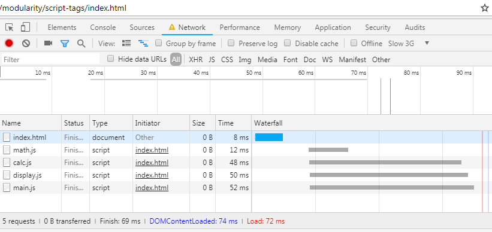
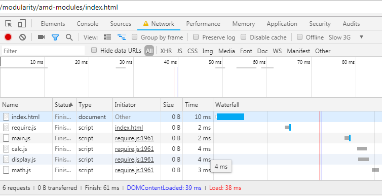
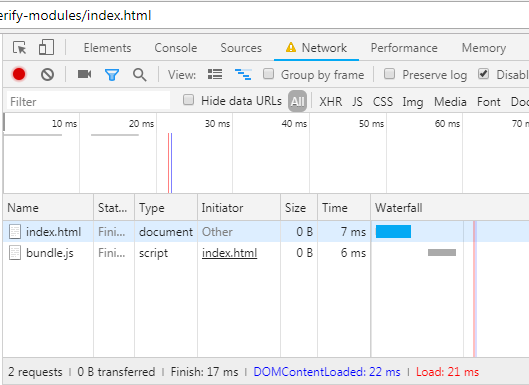

Modularity in JS
================

Decomposing code into smaller modules is a basic appraoch in programming to control complexity.
Each module has a smaller surface area than a full program, improving the readability, testability, and maintainability of the code base.

### Concept
The 'Module' construct in any programming language is meant to address the following concerns:
* Encapsulation - How to encapsulate the code and avoid exposing everything to the global scope.
* Expose an Interface - How to export necessary members to the oustide through a defined interface
* Dependency Refernce - A structured way to refer dependencies.

### Background
Node.js has always supported modular programming from its inception, however in the browser world the support has been lagging. Today there are a number of approaches and tools to handle modules.

### Different Approaces
We shall examine each of the different approaches here. In order to do that we shall use an example scenario. We have a simple application with the following components:  
1) An 'index.html' page that is the UI for the application
2) A 'main.js' that has the main application code. It is the entry point.
3) The 'main.js' uses functions from a 'calc.js' to calculate the RMS value of a list of numbers.
4) It uses a 'display.js' to display the value in HTML.
5) The 'calc.js' in turn uses a 'math.js' to do some calculations.

So the dependency graph looks like -  
<pre>
          |----> calc ----> math 
main ---->|
          |----> display
</pre>

1) **Using Script Tags**  
    Issues with this approach :   
    a) *Lack of Dependency Resolution*  
    The order of the dependnecies are important and we have to ensure that we load/refer the script files in the correct order, else the code will fail.  
    b) *Pollution of Global namespace*  
    All the functions and file level varaibles are at global level, and this can lead to overwrites and bugs. 

2) **Module Object & IIFE**  
    In this approach we can reduce the global namespace pollution by having just one global object that will have all the methods needed.
    We normally need an additional JS file to define our global application object.  
    Then in each of the other JS files we wrap the entire code in an IIFE and within that add the fucntions to our global object as its methods (this is also known as the 'module pattern').  
    This way everything within the IIFE remains private to that and only one object is exposed globally.
    This was a common approach taken by the early libraries such as jQuery (the global object is '$').
    This still we have the same issues with :  
    a) *Lack of Dependency Resolution*  
    b) *Limited pollution of Global namespace*  
        Now there is only one global object that wraps everyting within it.

3) **CommonJS**  
    In 2009 ServerJS was setup to standardize JS for the server side. This later became CommonJS.
    CommonJS is a standardization body just like ECMA and W3C.
    * _W3C - Defines the sndards for the Web and JS Web APIs and DOM_
    * _ECMA - Defines the JS langauge standards_
    * _CommonJS - Defines common APIs for server, web and command line_

    This includes API for modules in JS (though not for the browser).   
    In a CommonJS compliant platform such as Node.js each JS file is treated as a separate module.  
    In fact Node.js wraps the code in the file within a 'module wrapper' which looks something like - 
    ```javascript
    (function(exports, require, module, __filename, __dirname){
        // original code in file goes here
        const myFunc = function(){..}
        module.exports = myFunc;
    })
    ```
    This keeps all the top level objects at module level and not global. It also provides some handles to objects such as 'module', 'exports' etc.  
    In this case our example will not have any HTML and will be run as a Node.js app from the commandline.  

    The way to use CommonJS is quite straightforward -   
    Whatever we wish to expose outside of our module (file) we assign as value to 'module.exports' where 'module' is a global object implemented by Node.js.
    If we examine 'module' object for this project, we can see -

    ```javascript
    > module    
    Module {
    id: '.',
    exports: {},
    parent: null,
    filename: '<pwd>/main.js',
    loaded: false,
    children:
    [ Module {
        id: '<pwd>/calc.js',
        exports: [Function: calc_rms],
        parent: [Circular],
        filename: '<pwd>/calc.js',
        loaded: true,
        children: [Array],
        paths: [Array] },
        Module {
        id: '<pwd>/display.js',
        exports: [Function: display_value],
        parent: [Circular],
        filename: '<pwd>/display.js',
        loaded: true,
        children: [],
        paths: [Array] } ],
    paths:
    [ '<pwd>/node_modules',
        '<pwd>/../node_modules',
        ...
        '~/node_modules',
        'C/node_modules' ] }
    ```
    As we can see it has an 'exports' property and a set of 'paths'. The 'main.js' module has 2 child modules that it has imported viz. 'calc.js' and 'display.js'. note how the 'exports' property points to the exported object/function.  
    When we import a module using 'require()' function, it searches through the path for resolving the location and loading the module. When it finds the module it loads it returns whatever is associated with the 'module.exports' property.

4) **AMD**  
    Whilst CommonJS solves the problem for the server side, it has has a serious constrain for browser applications. The 'require()' function is a synchronous load and with nested dependencies this can block the browser from doing anything else while the modules load.  
    The Asynchronous Module Definition is a format that hopes to allieviate this issue by supporting asynchronous loading of modules.  
    The typical 'module pattern' looks like below:
    ```javascript
    (function(){
        aGlobalObj.exportedFunc = function() {};
    })();
    ```
    This approach relies on attaching properties to a global object.  
    Also the dependencies are assumed to be immediately available as soon as this function is executed, this limits the module loading strategies.

    AMD addresses these by providing a different pattern -
    ```javascript
    define(module_id // optional
        , ['dep1', 'dep2'] // dependencies
        , function(dep1, dep2){ // a module factory function
        // ... module code ...
        return function() {}
    })
    ```
    It introduces the concept of a 'define' function which takes an array of depenencies that is needed by our module (as strings just like the CommonJS approach), and a factory function that instantiates our module. _The 'module_id' parameter is optional (useful for edge cases)_.

    The AMD format takes a functional prgramming approach which allows:
    * Passing in the dependencies as arguments rather than relying on globals
    * The HOF 'define' takes a factory function that can be invoked once the required modules are loaded.  
    * Also note how the factory function uses 'Dependency Injection' pattern to provide the dependencies to the current module.

    The support for asynchrnous instantiation makes it ideal for today's browser scenarios. 

    ##### AMD Loaders
    There are a number of module loaders that implement the AMD format. Th emost common are -
    - RequireJS
    - cujojs/curl 

    Let us implement our example using AMD and RequireJS.  
    Now our 'math' module will look like -
    ```javascript
    // use AMD format to define our m
    define([], function(){
        // factory function for the module

        // module body
        function map(items, fun){
            // body suppressed for brevity
        }
        
        function reduce(items, fun, seed){
            // body suppressed for brevity
        }
        
        function sqrt(num){
            // body suppressed for brevity
        }

        // return an object with the exported methods
        return {
            map: map,
            reduce: reduce,
            sqrt: sqrt
        };
        /* 
        NOTE: Multiple functions exposed as methods ofwrapping object, 
        therefore it has to be accessed via 'obj.method' syntax when imported.
        */
    });
    ```
    Our 'calc' module which uses 'math' will look like -
    ```javascript
    // use AMD to define our module
    define(['math'], function(math){
        // specify 'math' as dependency
        // dependency injection of - 'math' 
        // factory function for the module

        // module body
        const calc_rms = function (numbers){
            // body suppressed for brevity
        }

        // return exposed function
        return calc_rms;
        /* 
        NOTE: function is directly exported without any wrapping object, 
        therefore it has to be accessed directly when imported.
        */
    });
    ```
    And our 'main' will now look like so -
    ```javascript
    // use AMD to define our module
    define(['calc', 'display'], function(calc, display){
        // specify our dependencies as an array
        // dependency injection of 'calc' and 'display'
        // factory function for module instantiation

        const numbers = [1, 2, 3, 4, 5, 6, 7, 8, 9];
        const rms = calc(numbers);
        const el = document.getElementById('value');
        display(el, rms);
        // accessing imported function directly
        /* 
        NOTE: The actual name of exported member is not important.
        In the 'display.js' module it was 'display_value'.
        What matters is the parameter we use for dependency injection. 
        */

        // nothing to export here
    });
    ```
    Finally our 'index.html'
    ```html
    <html>
    <head>
        <title>JS Modules with Script-tags</title>
    </head>
    <body>
        <h1>RMS value of the numbers is <span id="value"></span>
        </h1>
        <script data-main="main" src="require.js"></script>
    </body>
    </html>
    ```
    Note how it has only one 'script tag' the 'require.js', and this has a 'data-main' attribute that tells it what is the entry point. 'require.js' does the rest. We can see the effect of this in the browser's developer tools.  

    First the view of using 'script' tags directly in HTML -
      
    We can clearly observe the longer stall times (in grey) while the scripts get queued for loading. _Since this is a local page on my machine, the actual load time is negligible_
    
    Next the view of using 'require.js' -
      
    _NOTE: I have simulated a low speed network from the settings_  
    We can observe the following:
    * 'index.html' loads 'require.js' and that in turn loads the entry point 'main.js' which in turn loads its dependencies and so on recursivley.
    * There is very little stall time while the page is loading. This is time that the browser is not blocked. This is in contrast to using 'script' tags directly for all dependencies!

    For all its benefits AMD has some  minor drawbacks -
    1) The syntax is too verbose, wrapping everything up in 'define' and specifying all those dependencies as paramters.
    2) The list of dependencies in the array must match the parameter list of of the factory function. This can get quite cumbersome as the count increases.
    3) With todays HTTP 1.1 browsers loading many small files can degrade the performance! _Currently bundling the assets for download seems to perform better, however with HTTP/2 the behaviour may flip over to multiple small assets._

5) **Browserify**  
    Given that today performance is generally better in browsers with fewer assets to download (over HTTP/1.1), and the fact that AMD syntax is percieved as more verbose, a preferred appraoch is to use the CommonJS format and bundle the code together.  
    'Browserify' is a commnd line tool that achieves this. It traverses the dependency tree of our code and bundles them all into a single file. And we can use the CommonJS format.

    In order to use 'Browserify' we have to install it using NPM (so it requires Node.js and NPM installed first). So we first do that -
    ```bash
    $ npm install -g browserify

    ..\AppData\Roaming\npm\browserify -> ..\AppData\Roaming\npm\node_modules\browserify\bin\cmd.js
        + browserify@16.2.3
        added 137 packages in 61.987s
    ```
    So now we have brwiserify installed globally via npm.
    Now let us modify our example slightly to use browserify.  
    The JS code will look just like our CommonJS example, so the 'main.js' would be -
    ```javascript
    // browserify will use the CommonJS format for module
    // CommonJS will treat this file as a module

    // import the calculation module
    const calc_rms = require('./calc.js')
    // import the display module
    const display_value = require('./display.js')

    const numbers = [1, 2, 3, 4, 5, 6, 7, 8, 9];
    const rms = calc_rms(numbers);
    // use the single exported function 
    const el = document.getElementById('value');
    display_value(el, rms);
    // use the single exported function
    ```
    The other modules namely 'math.js', 'calc.js', 'display.js' will be on same lines (using CommonJS).  
    The 'index.html' however will have a slight change -
    ```html
    <html>
        <head>
            <title>JS Modules with Script-tags</title>
        </head>
        <body>
            <h1>RMS value of the numbers is <span id="value"></span>
            </h1>
            <script type="text/javascript" src="bundle.js"></script>
        </body>
    </html>
    ```
    Note how the script tag refers to a 'bundle.js' file (which we have not written)!

    Now we run 'browserify' bundler within our project directory -
    ```bash
    $ browserify main.js -o bundle.js
    ```
    Here we specify our entry point 'main.js' and the '-o' followed by the name we wish for the output (bundled) JS file. It is file that is specified in our script tag of our HTML.  
    Browserify will parse the JS files, traverse the dependency tree and create a single bundled JS file - 'bundle.js' -
    ```javascript
    (function(){function r(e,n,t){function o(i,f){if(!n[i]){if(!e[i]){var c="function"==typeof require&&require;if(!f&&c)return c(i,!0);if(u)return u(i,!0);var a=new Error("Cannot find module '"+i+"'");throw a.code="MODULE_NOT_FOUND",a}var p=n[i]={exports:{}};e[i][0].call(p.exports,function(r){var n=e[i][1][r];return o(n||r)},p,p.exports,r,e,n,t)}return n[i].exports}for(var u="function"==typeof require&&require,i=0;i<t.length;i++)o(t[i]);return o}return r})()({1:[function(require,module,exports){

        // our code will be here ...

    
        },{}]},{},[3]);
    ```
    The generated file is slightly cryptic looking but our familiar code sections are recognizable.

    Now let us see what the network characteristics are when we load the page -  
      
    And we can see that there is only one single JS file that gets downloaded which happens relatvely fast.


